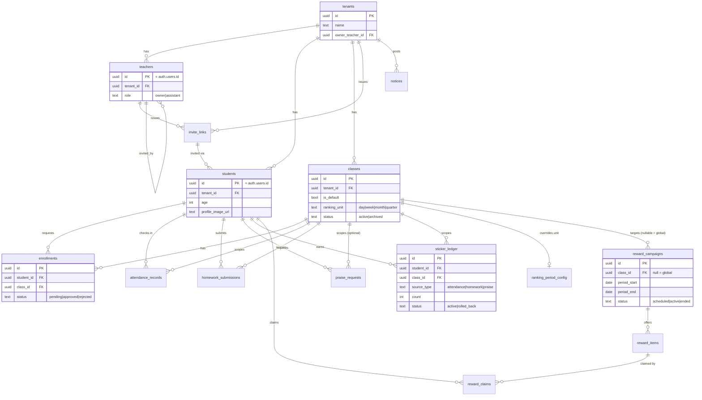

# DB 스키마: 학원 스티커 랭킹 앱 (Supabase / Postgres)

버전: v1.0 · 작성일: 2026-07-19 · 연관 문서: `PRD.md`, `IA.md`

이 문서는 `supabase/migrations/` 아래에 위치할 SQL 파일 4개(`20260719_01_init_schema.sql`, `20260719_02_functions_triggers.sql`, `20260719_03_rls_policies.sql`, `20260719_04_seed_dev.sql`)의 설계 배경과 ERD를 정리한다.

## 적용 순서
1. `20260719_01_init_schema.sql` — 테이블/제약조건
2. `20260719_02_functions_triggers.sql` — 헬퍼 함수, 자동배정 트리거, 랭킹 계산 함수
3. `20260719_03_rls_policies.sql` — 테넌트/역할 기반 RLS
4. `20260719_04_seed_dev.sql` — **로컬 개발 전용** 샘플 데이터 (운영 프로젝트에는 실행 금지)

## 설계 원칙
- **멀티테넌시**: 거의 모든 테이블에 `tenant_id`를 두어 RLS로 학원 간 데이터를 격리한다. 조인으로 유추 가능한 경우에도 조회 성능/정책 단순화를 위해 의도적으로 비정규화했다.
- **append-only 원장**: `sticker_ledger`가 스티커 총합/랭킹의 유일한 소스다. 출석/숙제/칭찬 각각의 원천 테이블(`attendance_records`, `homework_submissions`, `praise_requests`)은 신청·승인 과정의 세부 이력을 남기고, 실제 지급은 `sticker_ledger`에 반영된다. 롤백은 삭제가 아니라 `status = 'rolled_back'` 처리.
- **랭킹은 함수로 계산**: 별도 집계 테이블을 두지 않고 `get_ranking()` 함수가 그때그때 `sticker_ledger`를 집계한다. 데이터가 커지면 머티리얼라이즈드 뷰로 전환 가능.
- **동적 반 구조**: `classes`가 더 이상 고정 5개가 아니라 테넌트별 자유 생성 목록이며, `is_default` 플래그로 기본반을 구분한다(테넌트당 정확히 1개, 부분 유니크 인덱스로 강제).
- **랭킹 주기 ↔ 보상 캠페인 연동**: `ranking_period_config`(그룹별 단위기간)와 `reward_campaigns`(그룹별 period_start/end)는 별개 테이블이지만, 애플리케이션 레이어에서 캠페인 생성 시 `compute_period_bounds()` 함수로 현재 그룹의 주기를 미리 채워 넣도록 연결한다.

## ERD

## 핵심 함수

| 함수 | 설명 |
|---|---|
| `current_tenant_id()` | 현재 로그인한 사용자(teacher 또는 student)의 tenant_id 반환. 모든 RLS 정책의 기준 |
| `is_teacher()` / `is_owner()` / `is_student()` | 역할 판별 |
| `compute_period_bounds(unit, ref_date)` | day/week/month/quarter 단위의 현재 주기 시작일·종료일 계산 |
| `get_ranking(tenant_id, class_id, start, end)` | 지정 범위·기간의 랭킹을 계산해 순위·등급(gold/silver/bronze)까지 반환 |

## 운영 하드닝 TODO (프로덕션 전 반드시 확인)
1. `sticker_ledger` insert, `reward_claims` insert, 초대 링크 redeem은 현재 RLS로 최소 제약만 걸려 있다. 실서비스에서는 클라이언트가 개수·순번을 직접 지정해 insert하지 못하도록 **Supabase Edge Function 또는 SECURITY DEFINER RPC**로 감싸 서버에서 재계산 후 저장하도록 교체할 것.
2. `reward_campaigns` / `classes`의 자동 상태 전환(주기 종료 시 ended, 특강 기간 만료 시 archived)은 `pg_cron` 스케줄(파일 하단 주석 참고)을 Supabase 대시보드에서 활성화해야 실제로 동작한다.
3. 동점자 처리(현재: 먼저 활동한 학생이 상위)는 PRD Open Question 항목이므로, 정책이 확정되면 `get_ranking()`의 `order by` 절만 수정하면 된다.
4. `students`/`teachers`의 실제 가입(auth.users 생성)은 Supabase Auth 가입 플로우 또는 관리자 초대 API를 통해 처리하고, 이 문서의 시드 파일은 로컬 개발에서만 사용한다.
