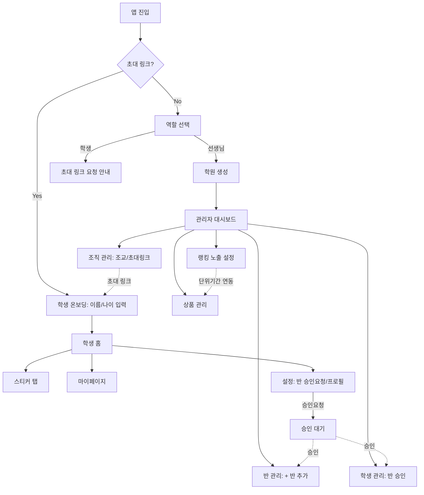
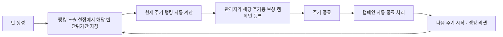

# IA (정보구조): 학원 출석/숙제/칭찬 스티커 랭킹 앱

버전: v2.0 · 작성일: 2026-07-19 · 연관 문서: `PRD_학원스티커랭킹앱.md`, `디자인가이드_학원스티커랭킹앱.md`

---

## 0. 전체 진입 흐름 (온보딩)

```
앱 진입
├─ 초대 링크로 접근 (/invite/{token})
│   └─ 역할 자동 판정: 학생 온보딩
│       ├─ 링크 검증(학원/발급 선생님 확인)
│       ├─ 이름 · 나이 입력
│       ├─ 계정 생성(이메일/비번 또는 소셜)
│       └─ 완료 → 학원 · 기본반 자동 소속 → 학생 앱 홈
├─ 일반 접근 (초대 링크 없음)
│   └─ 역할 선택
│       ├─ "선생님으로 시작하기"
│       │   ├─ 계정 생성
│       │   ├─ 학원 이름 입력 → 학원(테넌트) 생성, 기본반 자동 생성
│       │   └─ 완료 → 관리자 앱 대시보드 (Owner 권한)
│       └─ "학생으로 시작하기"
│           └─ 안내: "선생님에게 초대 링크를 받아주세요" (가입 진행 불가)
└─ 기존 계정 로그인
    └─ 역할에 따라 학생 앱 / 관리자 앱으로 분기
```

---

## 1. 학생 앱

```
학생 앱
├─ 상단바(공통): 로고 · 알림 · 설정
├─ 홈
│   ├─ 공지사항 플랩 배너 → 탭하면 전체 공지 목록
│   ├─ 이용자 정보(이름 · 소속 반)
│   ├─ 랭킹 포디움 블록
│   │   ├─ 기본 노출: 소속 그룹(특강반)이 있으면 그룹 랭킹 우선, 없으면 전체 랭킹
│   │   ├─ 상단 1·2·3위 카드(금/은/동, 각 1명) + 4~5위 리스트
│   │   ├─ 그룹/전체 전환 탭(여러 그룹 소속 시)
│   │   └─ [전체보기] → 상세 랭킹 오버레이(그룹별 탭 + 노출 단위기간 표시)
│   ├─ 보유 총 스티커 블록 → [체크 하러가기] → 스티커 탭(출석)
│   └─ 상품 블록(진행중 그룹별 캠페인명 + 가로 슬라이드 카드) → [다른 이벤트] → 전체 이벤트 오버레이
├─ 스티커 (출석 · 숙제 · 칭찬 내부 탭)
│   ├─ 출석: 반 선택 → 체크 버튼 (5단계 기준 안내는 아코디언 접힘, 반별로 정규 시각만 다름)
│   ├─ 숙제: 반 선택 → 완료율 3단계 선택 → 인증 신청 (신청 내역 노출)
│   └─ 칭찬: 사유 입력 → 요청 (요청 내역은 아코디언 접힘)
├─ 마이페이지
│   ├─ 소속 반 현황(승인됨/승인대기 상태 표시) — 신청 자체는 설정 화면에서
│   └─ 내 스티커 이력 — 아코디언 접힘
└─ 설정 (아이콘 진입)
    ├─ 소속 학원명 · 담당 선생님 이름 표시
    ├─ 프로필 설정(사진 등록, 이름 · 나이 수정)
    ├─ 소속 반 신청하기
    │   ├─ 반 목록 토글(다중 선택)
    │   └─ [승인요청하기] → 선택 반들에 대해 승인 대기 상태 생성
    ├─ 데모 계정 전환(개발/테스트용)
    └─ 알림 · 로그아웃 등
```

---

## 2. 관리자 앱 (원장 · 조교 공용, 일부 원장 전용 표시)

```
관리자 앱
├─ 로그인 / 온보딩(역할 선택, 학원 생성)
├─ 대시보드
│   └─ 승인 대기 · 오늘 출석 · 최근 로그 요약
├─ 공지사항 게시판
│   ├─ 작성(제목/내용/고정 여부)
│   └─ 고정 토글 · 삭제
├─ 스티커 정책 설정
│   ├─ 출석 5단계 지급 기준(읽기 전용: 정시5 · 10분4 · 30분3 · 1시간2 · 1시간초과1)
│   └─ 숙제 완료율별 지급 수(3단계, 수정 가능)
├─ 반 관리
│   ├─ [+ 반 추가] 버튼 → 반 이름 · 정규 출석 시각 · 운영 기간 입력
│   ├─ 반 목록(동적, 기본반 + 관리자가 생성한 반들)
│   ├─ 반별 정규 출석 시각 수정
│   └─ 반별 승인 대기 신청자 목록 → 승인/반려
├─ 학생 관리
│   ├─ 학생 목록 · 소속 반 현황
│   └─ 반 승인 대기 요청 처리(학생 관리 탭에서도 동일 승인/반려 가능)
├─ 승인함
│   ├─ 숙제 인증 승인/반려/수정
│   └─ 칭찬 스티커 요청 승인/반려
├─ 스티커 로그 · 감사
│   ├─ 전체 로그 조회(학생/유형/기간 필터)
│   ├─ 롤백(취소) 처리
│   └─ 취소 이력 조회
├─ 랭킹 노출 설정
│   ├─ 기본 노출 단위기간(디폴트: 이번 달)
│   ├─ 단위 선택: 일 단위 / 주 단위 / 월 단위 / 분기 단위
│   ├─ 그룹 우선 노출 정책 안내(온/오프 아님 — 그룹 있으면 항상 우선, 문구로 안내)
│   └─ [그룹별 랭킹 단위기간 설정하기] → 반별 단위기간 개별 지정
├─ 상품(리워드) 관리
│   ├─ 캠페인 등록: 적용 그룹 선택 → 해당 그룹 랭킹 단위기간 자동 표시/조정
│   ├─ 주기 종료 시 자동 "종료" 처리, 다음 주기 캠페인은 수동 재등록
│   └─ 선택(드래프트) 진행 현황
└─ 조직 관리 (신규)
    ├─ 조교 목록 · 추가(이메일 초대)
    │   └─ (원장 전용) 조교 권한 관리 · 제거
    └─ 학생 초대 링크
        ├─ 발급(발급자 = 현재 로그인한 선생님)
        └─ 링크 목록 · 상태(활성/만료) · 가입자 수
```

---

## 3. 화면 전환 다이어그램



---

## 4. 랭킹-보상 연동 흐름 (핵심 로직)



이 순환 구조가 의미하는 것: **랭킹 단위기간이 곧 보상 캠페인의 생명주기**이며, 관리자는 매 주기마다 반드시 새 보상을 설정해야 학생에게 보상이 계속 노출된다(자동 이월 없음).
